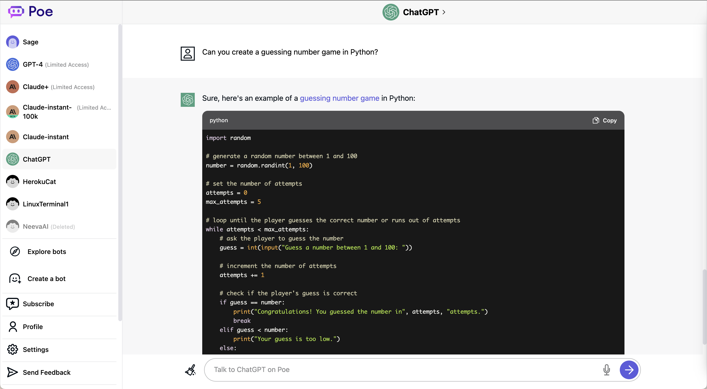
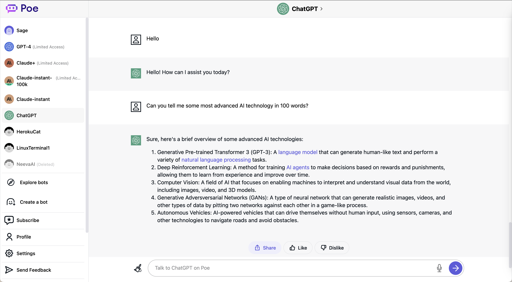
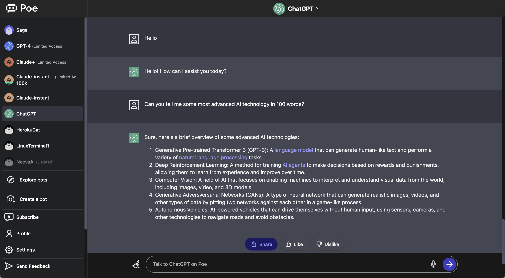

# ChatPoe
A Google Chrome extension that make Poe look like ChatGPT

- [ChatPoe](#chatpoe)
  - [Screenshots](#screenshots)
  - [How to use](#how-to-use)
  - [License](#license)
  - [Disclaimer](#disclaimer)

This is an open-source project that changes the appearance of the [Poe](https://poe.com/) web UI to a ChatGPT-like UI.

[Poe](https://poe.com/) is a chatbot application from Quora that is currently available on the web and iOS. Poe has several advantages over [ChatGPT](https://chat.openai.com/):

- You can access chat models other than ChatGPT.
- Chat generation is generally faster than ChatGPT (from my experience).
- Free Poe users can access Poe pretty much all the time, unlike free ChatGPT, which may block you when it is at high capacity.
- Poe is accessible in some locations that ChatGPT can't (e.g. HK).

However, there are several disadvantages to the Poe native web UI:

- It may be inconvenient to read a really long response in Poe as the chat bubble is narrow and you have to scroll a lot to read.
- The code styling of the Poe UI is not great and hard to read.

This Chrome extension changes the message display style for better readability.

## Screenshots
**Light Mode**

**Dark Mode**

## How to use
This extension is currently not listed in the Chrome Web Store yet. To use this extension, download this GitHub repository and load the extension in developer mode. The following are the instructions I found on [Google](https://support.google.com/chrome/a/answer/2714278) on how to load a local extension.

1. Go to chrome://extensions/.
2. At the top right, turn on Developer mode.
3. Click Load unpacked.

4. Find and select the app or extension folder.
5. Open a new tab in Chrome -> click Apps -> click the app or extension. Make sure it loads and works correctly.

## License
This repository is licensed under the Apache License 2.0. Feel free to create something fun with this project. I would be happy if you shared with me what you have done based on this project.

## Disclaimer
The extension only changes the appearance of Poe and does not collect any information or chat history. In fact, except for code styling, which uses [highlight.js](https://highlightjs.org/) to change the style, all of the appearance changes are done using CSS.

This is a quick weekend project for me to learn how to make a Chrome extension. There is no plan or roadmap for this project at the moment, but you are welcome to give me any suggestions or ideas.